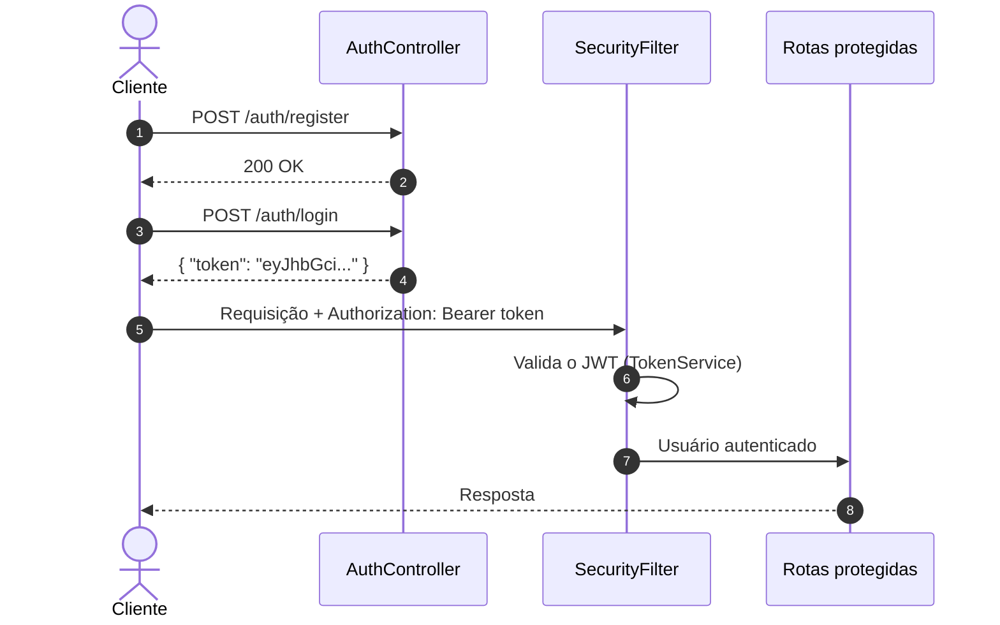
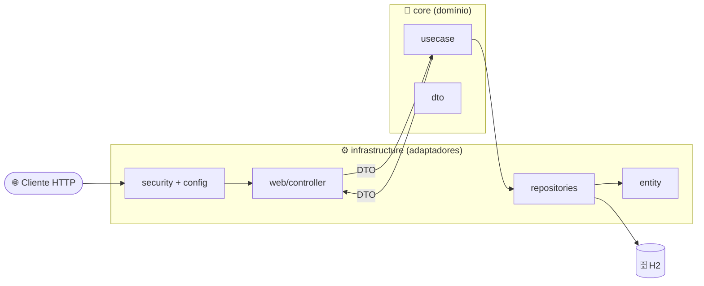
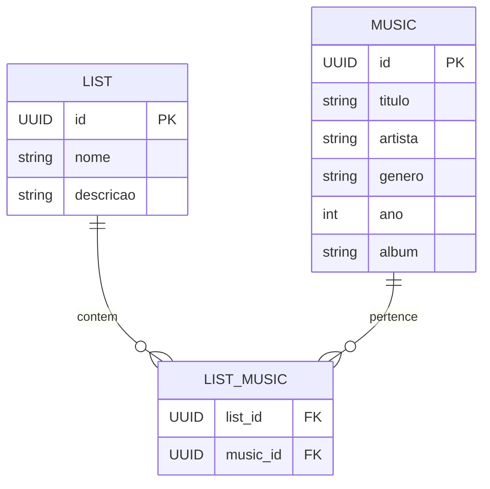

<div align="center">

# 🎵 Playlist Service API

**API REST para gerenciamento de Playlists e Músicas, com autenticação JWT.**

Construída com Clean/Hexagonal Architecture, Screaming Architecture e princípios SOLID.

<br/>


<br/><br/>


<br/><br/>

[Funcionalidades](#-funcionalidades) •
[Endpoints](#-endpoints) •
[Arquitetura](#️-arquitetura) •
[SOLID](#-princípios-solid) •
[Testes](#-testes-unitários) •
[Como Executar](#️-como-executar) •
[Contato](#-autor-e-contato)

</div>

---

## 📌 Sobre o Projeto

O **Playlist Service API** é um serviço backend para criar, consultar, editar e remover **playlists** e **músicas**. Todas as rotas de negócio são protegidas por **JWT** (stateless).

O foco do projeto é **engenharia de software**: domínio isolado, casos de uso com uma única responsabilidade e testes unitários cobrindo as regras de negócio.

> [!NOTE]
> O banco de dados é o **H2 em memória**. Você não precisa instalar nem configurar banco nenhum. Os dados são apagados toda vez que a aplicação reinicia.

---

## 🚀 Funcionalidades

<table>
  <tr>
    <th align="center">🔐 Autenticação</th>
    <th align="center">📂 Playlists</th>
    <th align="center">🎶 Músicas</th>
  </tr>
  <tr valign="top">
    <td>
      ✅ Registro de usuário<br/>
      ✅ Senha com hash BCrypt<br/>
      ✅ Login com geração de JWT<br/>
      ✅ Sessão stateless
    </td>
    <td>
      ✅ Criar playlist (com músicas)<br/>
      ✅ Listar todas<br/>
      ✅ Buscar por nome<br/>
      ✅ Excluir por nome<br/>
      ✅ Remover músicas da playlist
    </td>
    <td>
      ✅ Cadastrar música<br/>
      ✅ Buscar por título (parcial, sem diferenciar maiúsculas)<br/>
      ✅ Editar música<br/>
      ✅ Excluir por ID
    </td>
  </tr>
</table>

---

## 🔗 Endpoints

> [!IMPORTANT]
> Somente `/auth/register`, `/auth/login` e `/h2-console` são públicos. Todas as outras rotas exigem o header:
> `Authorization: Bearer <seu_token_jwt>`

<details open>
<summary><b>🔐 Auth</b> — <code>/auth</code></summary>

<br/>

| Método | Rota | Descrição | Auth |
| :---: | :--- | :--- | :---: |
|  | `/auth/register` | Registra um novo usuário | 🔓 |
|  | `/auth/login` | Autentica e retorna o token JWT | 🔓 |

<details>
<summary>📄 Exemplo de body (register)</summary>

```json
{
  "login": "teste@email.com",
  "password": "123456",
  "role": "USER"
}
```

</details>

<details>
<summary>📄 Exemplo de body (login)</summary>

```json
{
  "login": "teste@email.com",
  "password": "123456"
}
```

</details>

</details>

<details>
<summary><b>📂 Playlists</b> — <code>/lists</code></summary>

<br/>

| Método | Rota | Descrição | Auth |
| :---: | :--- | :--- | :---: |
|  | `/lists` | Cria uma playlist | 🔒 |
|  | `/lists` | Lista todas as playlists | 🔒 |
|  | `/lists/{listName}` | Busca uma playlist pelo nome | 🔒 |
|  | `/lists/{listName}` | Exclui uma playlist pelo nome | 🔒 |
|  | `/lists/{listName}/musics` | Remove músicas da playlist | 🔒 |

<details>
<summary>📄 Exemplo de body (criar playlist)</summary>

```json
{
  "nome": "Treino Pesado",
  "descricao": "Músicas para academia",
  "musicas": [
    {
      "titulo": "Eye of the Tiger",
      "artista": "Survivor",
      "genero": "Rock",
      "ano": 1982,
      "album": "Eye of the Tiger"
    }
  ]
}
```

</details>

<details>
<summary>📄 Exemplo de body (remover músicas)</summary>

```json
{
  "musicIds": [
    "uuid-da-musica-1",
    "uuid-da-musica-2"
  ]
}
```

</details>

</details>

<details>
<summary><b>🎶 Músicas</b> — <code>/musics</code></summary>

<br/>

| Método | Rota | Descrição | Auth |
| :---: | :--- | :--- | :---: |
|  | `/musics` | Cadastra uma música | 🔒 |
|  | `/musics/search?nome={titulo}` | Busca músicas pelo título | 🔒 |
|  | `/musics/{id}` | Edita uma música | 🔒 |
|  | `/musics/{id}` | Exclui uma música pelo ID | 🔒 |

<details>
<summary>📄 Exemplo de body (criar / editar música)</summary>

```json
{
  "titulo": "Eye of the Tiger",
  "artista": "Survivor",
  "genero": "Rock",
  "ano": 1982,
  "album": "Eye of the Tiger"
}
```

</details>

</details>

### 🔄 Fluxo de autenticação



---

## 🛠️ Tecnologias e Dependências

<details>
<summary><b>Ver lista completa de dependências</b></summary>

<br/>

| Dependência | Para que serve |
| :--- | :--- |
| **Java 21** | Linguagem (LTS), com uso de `records` nos DTOs |
| **Spring Boot 4.1.1** | Framework base da aplicação |
| `spring-boot-starter-webmvc` | Endpoints REST |
| `spring-boot-starter-data-jpa` | Persistência com JPA / Hibernate |
| `spring-boot-starter-security` | Proteção de rotas e autenticação |
| `spring-boot-starter-validation` | Validação dos DTOs (`@Valid`, `@NotBlank`, `@NotNull`) |
| `com.auth0:java-jwt` (4.4.0) | Geração e validação dos tokens JWT |
| `com.h2database:h2` | Banco relacional em memória |
| `spring-boot-h2console` | Console web do H2 |
| `lombok` | Menos boilerplate (`@Getter`, `@Setter`, `@Builder`...) |
| `*-test` starters (JUnit 5 + Mockito) | Testes unitários no estilo BDD |
| **Maven Wrapper** | Build sem precisar instalar o Maven |

</details>

---

## 🏗️ Arquitetura

### Visão em camadas (Hexagonal / Ports & Adapters)



<details>
<summary><b>💎 Hexagonal / Clean Architecture</b></summary>

<br/>

O código é separado de dentro para fora:

- **`core/`**: o centro. Contém as regras de negócio (`usecase`) e os contratos de entrada e saída (`dto`). Não depende de controllers nem de detalhes de HTTP.
- **`infrastructure/`**: a borda. Contém os adaptadores: controllers REST, repositórios JPA, entidades, filtros de segurança e configurações do Spring.

Os controllers conversam com o `core` **somente por meio de DTOs**. Assim, mudar a camada web ou o banco não altera a regra de negócio.

</details>

<details>
<summary><b>📣 Screaming Architecture</b></summary>

<br/>

A estrutura de pastas mostra **o que o sistema faz**, e não qual framework ele usa. Ao abrir `core/usecase`, você lê as ações do domínio: `ListCreator`, `ListMusicRemover`, `MusicEditor`, `MusicDeleteById`.

O domínio é o protagonista da organização. Não existe um `PlaylistService` genérico com tudo misturado.

</details>

<details>
<summary><b>📁 Estrutura de pastas</b></summary>

<br/>

```text
src/main/java/com/playlist_service/api
├── core
│   ├── dto
│   │   ├── Auth        → AuthenticationDTO, RegisterDTO, LoginResponseDTO
│   │   ├── List        → ListRequestDTO, ListResponseDTO
│   │   └── Music       → MusicRequestDTO, MusicResponseDTO, MusicRemovalRequestDTO
│   └── usecase
│       ├── List        → ListCreator, ListFinder, ListFinderByName,
│       │                 ListDeleteByName, ListMusicRemover
│       └── Music       → MusicCreator, MusicFinderByName, MusicEditor, MusicDeleteById
└── infrastructure
    ├── config          → SecurityConfig
    ├── entity          → ListModel, MusicModel, UserModel, UserRole
    ├── repositories    → ListRepository, MusicRepository, UserRepository
    ├── security        → SecurityFilter, TokenService, AuthorizationService
    └── web/controller  → AuthController, ListController, MusicController
```

</details>

<details>
<summary><b>🗃️ Modelo de dados</b></summary>

<br/>



> [!TIP]
> A relação N:N usa `Set` em vez de `List`. Isso evita o problema de produto cartesiano do Hibernate e garante que a mesma música não se repita na mesma playlist.

</details>

---

## 📐 Princípios SOLID

| Princípio | Como foi aplicado |
| :--- | :--- |
| **S** — Responsabilidade Única | Cada caso de uso faz uma única coisa. `ListCreator` só cria; `ListFinderByName` só busca. |
| **O** — Aberto/Fechado | Novas funcionalidades entram como **novos** casos de uso, sem alterar os que já existem. |
| **L** — Substituição de Liskov | Os repositórios estendem `JpaRepository` e podem ser trocados por qualquer implementação do contrato (ex.: mocks nos testes). |
| **I** — Segregação de Interfaces | Os controllers recebem só os casos de uso de que precisam, em vez de um "God Service" gigante. |
| **D** — Inversão de Dependência | O `core` depende de abstrações (interfaces de repositório). O Spring injeta as implementações pelo construtor. |

---

## 🧪 Testes Unitários

<div align="center">


</div>

Os testes usam **JUnit 5** e **Mockito**, no estilo BDD (`given / willReturn / then`). Eles cobrem o caminho feliz e os cenários de erro (recurso inexistente, duplicado etc.).

<details>
<summary><b>📋 Ver classes de teste</b></summary>

<br/>

| Contexto | Classe de teste |
| :--- | :--- |
| 📂 Playlists | `ListCreatorTest` |
| 📂 Playlists | `ListFinderTest` |
| 📂 Playlists | `ListFinderByNameTest` |
| 📂 Playlists | `ListDeleteByNameTest` |
| 📂 Playlists | `ListMusicRemoverTest` |
| 🎶 Músicas | `MusicCreatorTest` |
| 🎶 Músicas | `MusicFinderByNameTest` |
| 🎶 Músicas | `MusicEditorTest` |
| 🎶 Músicas | `MusicDeleteByIdTest` |
| 🔐 Auth | `AuthControllerTest` |
| ⚙️ Contexto | `ApiApplicationTests` |

</details>

---

## ⚙️ Como Executar

### 📋 Pré-requisitos

| Ferramenta | Obrigatório | Observação |
| :--- | :---: | :--- |
| [Git](https://git-scm.com) | ✅ | Para clonar o repositório |
| [Java 21 (JDK)](https://adoptium.net/) | ✅ | Para compilar e rodar |
| [Maven](https://maven.apache.org/) | ❌ | O projeto já inclui o Maven Wrapper (`mvnw`) |
| [Postman](https://www.postman.com/) | ❌ | Recomendado para testar os endpoints |

> [!TIP]
> Confira se o Java está instalado com `java -version`. A saída deve mostrar a versão **21**.

### 1️⃣ Clonar o repositório

```bash
git clone https://github.com/Cloves-Neto/back-playlist-service.git
cd back-playlist-service
```

### 2️⃣ Rodar a aplicação

<details open>
<summary>🪟 <b>Windows</b></summary>

```cmd
.\mvnw.cmd spring-boot:run
```

</details>

<details>
<summary>🐧 <b>Linux / macOS</b></summary>

```bash
chmod +x mvnw
./mvnw spring-boot:run
```

</details>

A API sobe em **`http://localhost:8080`**.

> [!NOTE]
> Na primeira execução, o Maven baixa todas as dependências. Isso pode levar alguns minutos.

### 3️⃣ Rodar os testes

<details open>
<summary>🪟 <b>Windows</b></summary>

```cmd
.\mvnw.cmd test
```

</details>

<details>
<summary>🐧 <b>Linux / macOS</b></summary>

```bash
./mvnw test
```

</details>

### 4️⃣ Acessar o console do H2 (opcional)

| Campo | Valor |
| :--- | :--- |
| URL | `http://localhost:8080/h2-console` |
| JDBC URL | `jdbc:h2:mem:playlistdb` |
| User Name | `sa` |
| Password | *(em branco)* |

### 5️⃣ Testar com o Postman

1. Abra o Postman e clique em **Import**.
2. Selecione o arquivo [`docs/Playlist_Service.postman_collection.json`](docs/Playlist_Service.postman_collection.json).
3. Execute **Auth → Register** e depois **Auth → Login**.
4. Pronto: as outras requisições já usam o token automaticamente.

> [!IMPORTANT]
> O request de **Login** tem um script que salva o token na variável `{{jwt_token}}`. Para isso funcionar, deixe um **Environment** selecionado no Postman.

---

## 📫 Autor e Contato

<div align="center">

[](https://devneto.com.br)
[](https://www.linkedin.com/in/cloves-neto)
[](https://wa.me/5511967338685)
[](mailto:cvr.neo20@gmail.com)

</div>
