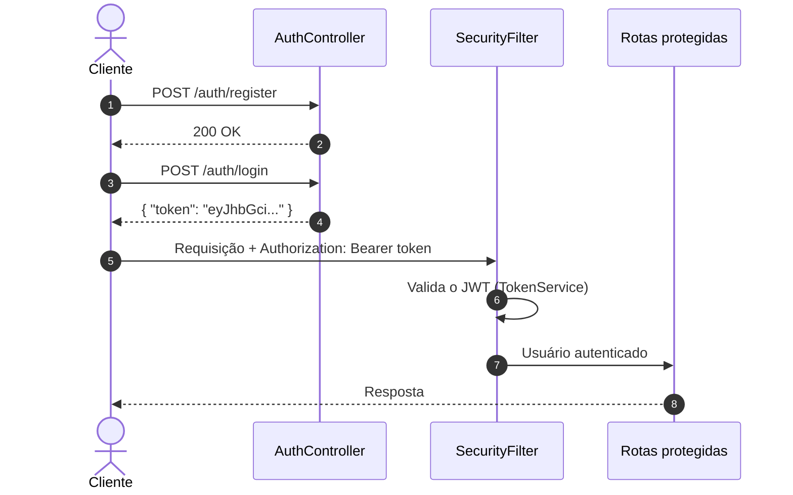
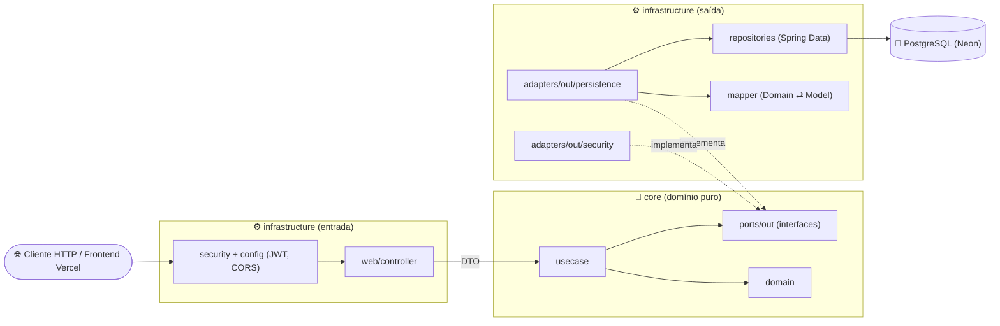
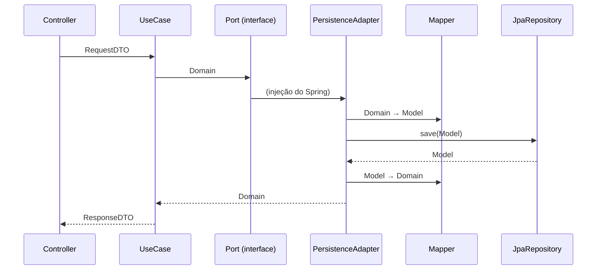
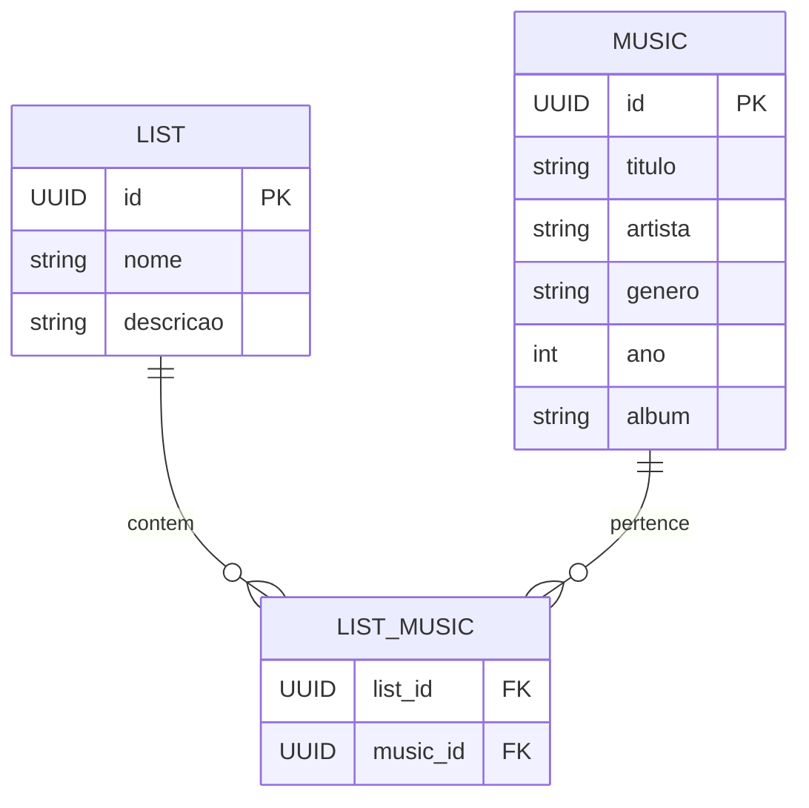
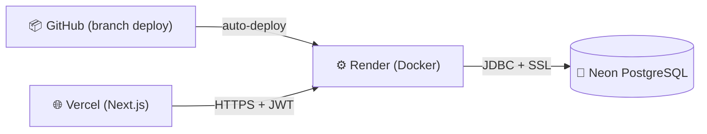

<div align="center">

# 🎵 Playlist Service API

**API REST para gerenciamento de Playlists e Músicas, com autenticação JWT.**

Construída com Clean/Hexagonal Architecture, Screaming Architecture e princípios SOLID.

<br/>


<br/><br/>


<br/><br/>

[Funcionalidades](#-funcionalidades) •
[Endpoints](#-endpoints) •
[Arquitetura](#️-arquitetura) •
[SOLID](#-princípios-solid) •
[Testes](#-testes-unitários) •
[Variáveis de Ambiente](#-variáveis-de-ambiente) •
[Como Executar](#️-como-executar) •
[Deploy](#-deploy-render--neon) •
[Contato](#-autor-e-contato)

</div>

---

## 📌 Sobre o Projeto

O **Playlist Service API** é um serviço backend para criar, consultar, editar e remover **playlists** e **músicas**. Todas as rotas de negócio são protegidas por **JWT** (stateless).

O foco do projeto é **engenharia de software**: domínio isolado, casos de uso com uma única responsabilidade e testes unitários cobrindo as regras de negócio.

> [!NOTE]
> O banco de dados é **PostgreSQL** (hospedado no **Neon** em produção). A conexão é feita pela variável de ambiente `DB_URL` — **nenhuma credencial fica no código**. As tabelas são criadas/atualizadas automaticamente pelo Hibernate (`ddl-auto=update`).

| Ambiente | URL |
| :--- | :--- |
| 🌐 Frontend (Vercel) | [app-playlist-service.vercel.app](https://app-playlist-service.vercel.app) |
| ⚙️ Backend (Render) | Web Service Docker no Render |
| 🗄️ Banco (Neon) | PostgreSQL serverless (`sa-east-1`) |

---

## 🚀 Funcionalidades

<table>
  <tr>
    <th align="center">🔐 Autenticação</th>
    <th align="center">📂 Playlists</th>
    <th align="center">🎶 Músicas</th>
  </tr>
  <tr valign="top">
    <td>
      ✅ Registro de usuário<br/>
      ✅ Senha com hash BCrypt<br/>
      ✅ Login com geração de JWT<br/>
      ✅ Sessão stateless
    </td>
    <td>
      ✅ Criar playlist (com músicas)<br/>
      ✅ Listar todas<br/>
      ✅ Buscar por nome<br/>
      ✅ Excluir por nome<br/>
      ✅ Adicionar músicas à playlist<br/>
      ✅ Remover músicas da playlist
    </td>
    <td>
      ✅ Cadastrar música<br/>
      ✅ Buscar por título (parcial, sem diferenciar maiúsculas)<br/>
      ✅ Editar música<br/>
      ✅ Excluir por ID
    </td>
  </tr>
</table>

---

## 🔗 Endpoints

> [!IMPORTANT]
> Somente `POST /auth/register` e `POST /auth/login` são públicos. Todas as outras rotas exigem o header:
> `Authorization: Bearer <seu_token_jwt>`

<details open>
<summary><b>🔐 Auth</b> — <code>/auth</code></summary>

<br/>

| Método | Rota | Descrição | Auth |
| :---: | :--- | :--- | :---: |
|  | `/auth/register` | Registra um novo usuário | 🔓 |
|  | `/auth/login` | Autentica e retorna o token JWT | 🔓 |

<details>
<summary>📄 Exemplo de body (register)</summary>

```json
{
  "login": "teste@email.com",
  "password": "123456",
  "role": "USER"
}
```

</details>

<details>
<summary>📄 Exemplo de body (login)</summary>

```json
{
  "login": "teste@email.com",
  "password": "123456"
}
```

</details>

</details>

<details>
<summary><b>📂 Playlists</b> — <code>/lists</code></summary>

<br/>

| Método | Rota | Descrição | Auth |
| :---: | :--- | :--- | :---: |
|  | `/lists` | Cria uma playlist | 🔒 |
|  | `/lists` | Lista todas as playlists | 🔒 |
|  | `/lists/{listName}` | Busca uma playlist pelo nome | 🔒 |
|  | `/lists/{listName}/musics` | Adiciona músicas existentes à playlist | 🔒 |
|  | `/lists/{listName}` | Exclui uma playlist pelo nome | 🔒 |
|  | `/lists/{listName}/musics` | Remove músicas da playlist | 🔒 |

<details>
<summary>📄 Exemplo de body (criar playlist)</summary>

```json
{
  "nome": "Treino Pesado",
  "descricao": "Músicas para academia",
  "musicas": [
    {
      "titulo": "Eye of the Tiger",
      "artista": "Survivor",
      "genero": "Rock",
      "ano": 1982,
      "album": "Eye of the Tiger"
    }
  ]
}
```

</details>

<details>
<summary>📄 Exemplo de body (adicionar / remover músicas)</summary>

```json
{
  "musicIds": [
    "uuid-da-musica-1",
    "uuid-da-musica-2"
  ]
}
```

</details>

</details>

<details>
<summary><b>🎶 Músicas</b> — <code>/musics</code></summary>

<br/>

| Método | Rota | Descrição | Auth |
| :---: | :--- | :--- | :---: |
|  | `/musics` | Cadastra uma música | 🔒 |
|  | `/musics/search?nome={titulo}` | Busca músicas pelo título | 🔒 |
|  | `/musics/{id}` | Edita uma música | 🔒 |
|  | `/musics/{id}` | Exclui uma música pelo ID | 🔒 |

<details>
<summary>📄 Exemplo de body (criar / editar música)</summary>

```json
{
  "titulo": "Eye of the Tiger",
  "artista": "Survivor",
  "genero": "Rock",
  "ano": 1982,
  "album": "Eye of the Tiger"
}
```

</details>

</details>

### 🔄 Fluxo de autenticação



---

## 🛠️ Tecnologias e Dependências

<details>
<summary><b>Ver lista completa de dependências</b></summary>

<br/>

| Dependência | Para que serve |
| :--- | :--- |
| **Java 21** | Linguagem (LTS), com uso de `records` nos DTOs |
| **Spring Boot 4.1.1** | Framework base da aplicação |
| `spring-boot-starter-webmvc` | Endpoints REST |
| `spring-boot-starter-data-jpa` | Persistência com JPA / Hibernate |
| `spring-boot-starter-security` | Proteção de rotas e autenticação |
| `spring-boot-starter-validation` | Validação dos DTOs (`@Valid`, `@NotBlank`, `@NotNull`) |
| `com.auth0:java-jwt` (4.4.0) | Geração e validação dos tokens JWT |
| `org.postgresql:postgresql` | Driver JDBC do PostgreSQL (Neon) |
| `lombok` | Menos boilerplate (`@Getter`, `@Setter`, `@Builder`...) |
| `*-test` starters (JUnit 5 + Mockito) | Testes unitários no estilo BDD |
| **Maven Wrapper** | Build sem precisar instalar o Maven |
| **Docker** (`eclipse-temurin:21`) | Imagem multi-stage (JDK no build, JRE no runtime) |

</details>

---

## 🏗️ Arquitetura

### Visão em camadas (Hexagonal / Ports & Adapters)



<details>
<summary><b>💎 Hexagonal / Ports & Adapters</b></summary>

<br/>

O código é separado de dentro para fora:

- **`core/domain`**: modelos de domínio puros (`ListDomain`, `MusicDomain`, `UserDomain`) — **sem anotações JPA ou Spring**.
- **`core/ports/out`**: contratos que o domínio precisa do mundo externo (`ListDatabasePort`, `MusicDatabasePort`, `UserDatabasePort`, `PasswordEncoderPort`).
- **`core/usecase`**: regras de negócio. Dependem **apenas** dos ports, nunca de `JpaRepository` ou do Spring Security.
- **`infrastructure/adapters/out`**: implementações dos ports. Os `*PersistenceAdapter` usam os repositórios Spring Data e os `*Mapper` convertem `Domain ⇄ Model`. O `BCryptPasswordEncoderAdapter` implementa o `PasswordEncoderPort`.
- **`infrastructure/web`, `security`, `config`**: adaptadores de entrada (REST, filtro JWT, CORS).

Resultado: trocar o banco (H2 → PostgreSQL, por exemplo) ou o algoritmo de hash **não altera nenhum caso de uso**.

</details>

<details>
<summary><b>🔁 Fluxo de uma requisição</b></summary>

<br/>



</details>

<details>
<summary><b>📣 Screaming Architecture</b></summary>

<br/>

A estrutura de pastas mostra **o que o sistema faz**, e não qual framework ele usa. Ao abrir `core/usecase`, você lê as ações do domínio: `ListCreator`, `ListMusicAdder`, `ListMusicRemover`, `MusicEditor`, `MusicDeleteById`, `UserRegistrar`.

O domínio é o protagonista da organização. Não existe um `PlaylistService` genérico com tudo misturado.

</details>

<details>
<summary><b>📁 Estrutura de pastas</b></summary>

<br/>

```text
src/main/java/com/playlist_service/api
├── core
│   ├── domain          → ListDomain, MusicDomain, UserDomain, UserRole
│   ├── dto
│   │   ├── Auth        → AuthenticationDTO, RegisterDTO, LoginResponseDTO
│   │   ├── List        → ListRequestDTO, ListResponseDTO
│   │   └── Music       → MusicRequestDTO, MusicResponseDTO,
│   │                     MusicAdditionRequestDTO, MusicRemovalRequestDTO
│   ├── ports/out       → ListDatabasePort, MusicDatabasePort,
│   │                     UserDatabasePort, PasswordEncoderPort
│   └── usecase
│       ├── Auth        → UserRegistrar
│       ├── List        → ListCreator, ListFinder, ListFinderByName,
│       │                 ListDeleteByName, ListMusicAdder, ListMusicRemover
│       └── Music       → MusicCreator, MusicFinderByName, MusicEditor, MusicDeleteById
└── infrastructure
    ├── adapters/out
    │   ├── persistence → List/Music/UserPersistenceAdapter
    │   │   └── mapper  → ListMapper, MusicMapper, UserMapper
    │   └── security    → BCryptPasswordEncoderAdapter
    ├── config          → SecurityConfig (rotas públicas + CORS)
    ├── entity          → ListModel, MusicModel, UserModel, UserRole
    ├── repositories    → ListRepository, MusicRepository, UserRepository
    ├── security        → SecurityFilter, TokenService, AuthorizationService
    └── web/controller  → AuthController, ListController, MusicController
```

</details>

<details>
<summary><b>🗃️ Modelo de dados</b></summary>

<br/>



> [!TIP]
> A relação N:N usa `Set` em vez de `List`. Isso evita o problema de produto cartesiano do Hibernate e garante que a mesma música não se repita na mesma playlist.

</details>

---

## 📐 Princípios SOLID

| Princípio | Como foi aplicado |
| :--- | :--- |
| **S** — Responsabilidade Única | Cada caso de uso faz uma única coisa. `ListCreator` só cria; `ListFinderByName` só busca. |
| **O** — Aberto/Fechado | Novas funcionalidades entram como **novos** casos de uso, sem alterar os que já existem. |
| **L** — Substituição de Liskov | Qualquer implementação de um port (`*PersistenceAdapter`, mocks nos testes) pode substituir outra sem quebrar os casos de uso. |
| **I** — Segregação de Interfaces | Os controllers recebem só os casos de uso de que precisam, em vez de um "God Service" gigante. |
| **D** — Inversão de Dependência | O `core` depende só dos **ports** (interfaces próprias). A infraestrutura implementa esses ports e o Spring injeta os adapters pelo construtor. |

---

## 🧪 Testes Unitários

<div align="center">


</div>

Os testes usam **JUnit 5** e **Mockito**, no estilo BDD (`given / willReturn / then`). Eles cobrem o caminho feliz e os cenários de erro (recurso inexistente, duplicado etc.). Como os casos de uso dependem apenas dos **ports**, os testes mockam as interfaces do domínio — sem banco e sem Spring.

<details>
<summary><b>📋 Ver classes de teste</b></summary>

<br/>

| Contexto | Classe de teste |
| :--- | :--- |
| 📂 Playlists | `ListCreatorTest` |
| 📂 Playlists | `ListFinderTest` |
| 📂 Playlists | `ListFinderByNameTest` |
| 📂 Playlists | `ListDeleteByNameTest` |
| 📂 Playlists | `ListMusicAdderTest` |
| 📂 Playlists | `ListMusicRemoverTest` |
| 🎶 Músicas | `MusicCreatorTest` |
| 🎶 Músicas | `MusicFinderByNameTest` |
| 🎶 Músicas | `MusicEditorTest` |
| 🎶 Músicas | `MusicDeleteByIdTest` |
| 🔐 Auth | `AuthControllerTest` |
| ⚙️ Contexto | `ApiApplicationTests` |

</details>

---

## 🔐 Variáveis de Ambiente

Nenhuma credencial é versionada. O [`application.properties`](src/main/resources/application.properties) apenas referencia variáveis:

```properties
spring.datasource.url=${DB_URL}
```

| Variável | Obrigatória | Descrição | Exemplo |
| :--- | :---: | :--- | :--- |
| `DB_URL` | ✅ | URL JDBC completa do PostgreSQL (com usuário, senha e SSL) | `jdbc:postgresql://<host>/<db>?user=<user>&password=<senha>&sslmode=require` |
| `API_SECURITY_TOKEN_SECRET` | ⚠️ Recomendada | Segredo usado para assinar os JWT (`api.security.token.secret`). Sem ela, usa um valor padrão inseguro | `uma-string-longa-e-aleatoria` |

> [!CAUTION]
> Nunca faça commit da `DB_URL` real ou do segredo JWT. Configure-os apenas no painel do Render (produção) ou no seu terminal/IDE (local).

---

## ⚙️ Como Executar

### 📋 Pré-requisitos

| Ferramenta | Obrigatório | Observação |
| :--- | :---: | :--- |
| [Git](https://git-scm.com) | ✅ | Para clonar o repositório |
| [Java 21 (JDK)](https://adoptium.net/) | ✅* | Para rodar sem Docker |
| [Docker](https://www.docker.com/) | ✅* | Alternativa ao JDK local |
| Banco PostgreSQL | ✅ | Neon (grátis) ou um Postgres local |
| [Maven](https://maven.apache.org/) | ❌ | O projeto já inclui o Maven Wrapper (`mvnw`) |
| [Postman](https://www.postman.com/) | ❌ | Recomendado para testar os endpoints |

<sub>* Basta um dos dois: JDK 21 **ou** Docker.</sub>

> [!TIP]
> Confira se o Java está instalado com `java -version`. A saída deve mostrar a versão **21**.

### 1️⃣ Clonar o repositório

```bash
git clone https://github.com/Cloves-Neto/back-playlist-service.git
cd back-playlist-service
```

### 2️⃣ Rodar a aplicação (local)

<details open>
<summary>🪟 <b>Windows (PowerShell)</b></summary>

```powershell
$env:DB_URL="jdbc:postgresql://<host>/<db>?user=<user>&password=<senha>&sslmode=require"
$env:API_SECURITY_TOKEN_SECRET="meu-segredo-local"
.\mvnw.cmd spring-boot:run
```

</details>

<details>
<summary>🐧 <b>Linux / macOS</b></summary>

```bash
export DB_URL="jdbc:postgresql://<host>/<db>?user=<user>&password=<senha>&sslmode=require"
export API_SECURITY_TOKEN_SECRET="meu-segredo-local"
chmod +x mvnw
./mvnw spring-boot:run
```

</details>

<details>
<summary>🐳 <b>Docker</b></summary>

```bash
docker build -t playlist-service .
docker run -p 8080:8080 \
  -e DB_URL="jdbc:postgresql://<host>/<db>?user=<user>&password=<senha>&sslmode=require" \
  -e API_SECURITY_TOKEN_SECRET="meu-segredo-local" \
  playlist-service
```

O [`Dockerfile`](Dockerfile) é multi-stage: compila com `eclipse-temurin:21-jdk-alpine` e roda com `eclipse-temurin:21-jre-alpine` (imagem final enxuta).

</details>

> [!TIP]
> Em IDEs como IntelliJ, configure as variáveis em **Run → Edit Configurations → Environment variables**.

A API sobe em **`http://localhost:8080`**.

> [!NOTE]
> Na primeira execução, o Maven baixa todas as dependências. Isso pode levar alguns minutos.

### 3️⃣ Rodar os testes

<details open>
<summary>🪟 <b>Windows</b></summary>

```cmd
.\mvnw.cmd test
```

</details>

<details>
<summary>🐧 <b>Linux / macOS</b></summary>

```bash
./mvnw test
```

</details>

### 4️⃣ Testar com o Postman

1. Abra o Postman e clique em **Import**.
2. Selecione o arquivo [`docs/Playlist_Service.postman_collection.json`](docs/Playlist_Service.postman_collection.json).
3. Execute **Auth → Register** e depois **Auth → Login**.
4. Pronto: as outras requisições já usam o token automaticamente.

> [!IMPORTANT]
> O request de **Login** tem um script que salva o token na variável `{{jwt_token}}`. Para isso funcionar, deixe um **Environment** selecionado no Postman.

---

## 🚀 Deploy (Render + Neon)



### 1️⃣ Banco no Neon

1. Crie um projeto em [neon.tech](https://neon.tech) (região `sa-east-1` recomendada).
2. Copie a connection string no formato **JDBC** (com `sslmode=require`).

### 2️⃣ Web Service no Render

| Configuração | Valor |
| :--- | :--- |
| Tipo | **Web Service** |
| Repositório / Branch | `back-playlist-service` / `deploy` |
| Runtime | **Docker** (usa o `Dockerfile` da raiz) |
| Porta | `8080` |
| Environment | `DB_URL` e `API_SECURITY_TOKEN_SECRET` |

> [!NOTE]
> O `Dockerfile` executa `chmod +x ./mvnw` antes do build. Sem isso o Render falha com `./mvnw: Permission denied` (exit code 126), pois o bit de execução pode se perder no Git vindo do Windows.

### 3️⃣ Frontend na Vercel

No projeto do frontend, configure a variável:

| Variável | Valor |
| :--- | :--- |
| `NEXT_PUBLIC_API_URL` | URL pública do serviço no Render (ex.: `https://<seu-servico>.onrender.com`) |

### 🌍 CORS

O [`SecurityConfig`](src/main/java/com/playlist_service/api/infrastructure/config/SecurityConfig.java) libera as origens:

- `http://localhost:3000` / `http://127.0.0.1:3000` (desenvolvimento)
- `https://app-playlist-service.vercel.app` (produção)

Para um novo domínio de frontend, adicione-o em `setAllowedOrigins`.

> [!TIP]
> Acessar a raiz do backend no navegador retorna **403 Forbidden** — isso é esperado: toda rota fora de `/auth/**` exige JWT. No plano gratuito, o Render hiberna o serviço após inatividade, então a primeira requisição pode levar ~50s.

---

## 📫 Autor e Contato

<div align="center">

[](https://devneto.com.br)
[](https://www.linkedin.com/in/cloves-neto)
[](https://wa.me/5511967338685)
[](mailto:cvr.neo20@gmail.com)

</div>
